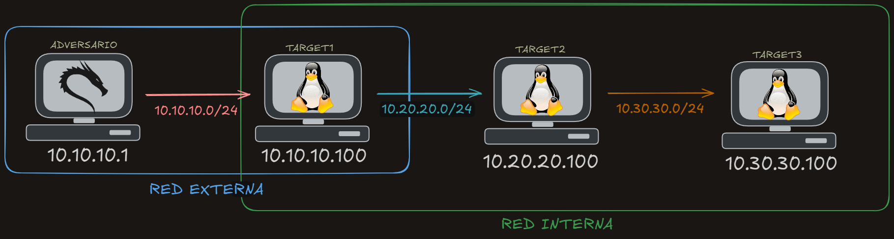

# Laboratorio de Pivoting

Este es un laboratorio de pivoting creado en Docker, que simula tres máquinas Linux a las cuales se les proporcionan usuarios para acceder mediante SSH. La finalidad es enfocarse únicamente en el pivoting, sin necesidad de preocuparse por la explotación.

A continuación, se muestra un diagrama de la red.




## Requerimientos

```
  sudo apt update
  sudo apt install docker.io -y
  sudo systemctl enable docker
  sudo systemctl start docker
```

## Instalación 
```
  git clone https://github.com/XK3NF4/pivoting-lab.git
  cd pivoting-lab
  chmod +x ./deploy.sh
  sudo ./deploy.sh
```

Si deseas eliminar el laboratorio, ejecuta el siguiente script:
```
chmod +x ./clear.sh 
sudo ./clear.sh
```
### Usuarios creados: 
- bob:bob - Target1
- alice:alice - Target2
- sabu:sabu - Target3
